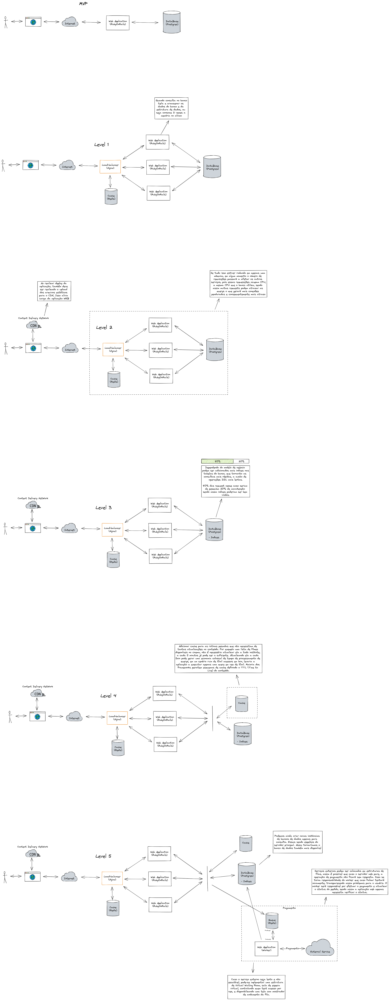

# scalable-web-application

Conceitos para melhorar a escalabilidade de uma aplicação web.

___

A imagem está dividida em níveis com explicações de coisas que podem ser feitas para melhorar os aspectos de disponibilidade de aplicações WEB.

